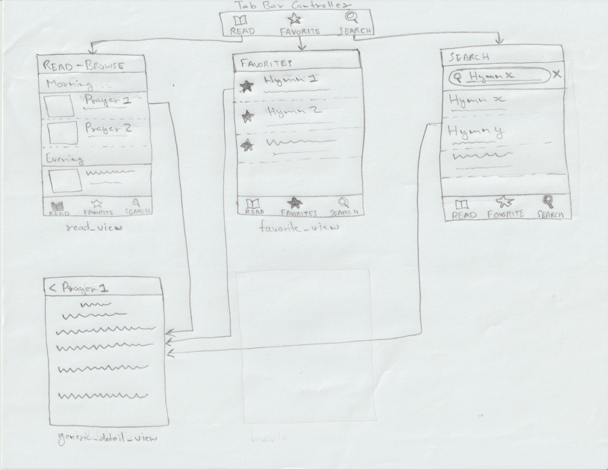

Original App Design Project - README Template
===

# Gurbani Searcher

## Table of Contents

1. [Overview](#Overview)
2. [Product Spec](#Product-Spec)
3. [Wireframes](#Wireframes)
4. [Schema](#Schema)

## Overview

### Description

An expansive database of Sikh Prayers that let users pray with ease-of-use. I encourage users to create their persolized translations which reflets on their spritual journey.

### App Evaluation

- **Category:** Lifestyle / Reference / Education
- **Mobile:** The app's eases-of-use comes with mobile experience. Users prefer to ready hyms on a hand-held device. Some functinality like iCloud Backup needs mobile interface. Also it needs isolation from other UI elements like browser UI to let user focus.
- **Story:** This app address and fix various drawbacks in the current impimentation of such kind of apps like outdated UI, not easy to use. It engourage user  to be in heigher state of mind.
- **Market:** Although the maket is majority of sikh diaespora, but its no means a small population scattered worldwide.
- **Habit:** The app is adictive to the niche group of people who see value in it. Average use of the app is around 2-3 times a day for 2-3 hours.
- **Scope:** The most challenging part is creating or obtaining the correct database. Alpha versions will be using a dumy placeholder data to represent the functionality. The product is very thoughfully designed with multiple revisions.

## Product Spec

### 1. User Stories (Required and Optional)

**Required Must-have Stories**

* **Read:** - User can read hymes from database.
* **Search:** - User can search the database for specific hymes by word.
* **Bookmark:** - User can bookmark favorite hymes.

**Optional Nice-to-have Stories**

* Engagement Stats: The app logs the time interval the user interacts on the app.

### 2. Screen Archetypes

- [ ] Stream
* User can go through different Prayer organized by title.
* User can bookmark a hyme to make it appear in Favorite List.
* User can search by words to query matching hymes in list view.

- [ ] Detail
* User can view a specific prayer by taping stream view title.
* User can read the prayer now.

### 3. Navigation

**Tab Navigation** (Tab to Screen)

* Read view
* Favorite view
* Search view

**Flow Navigation** (Screen to Screen)

- [ ] Read view Stream
* Read detail view

- [ ] Favorite view Stream
* Favorite detail view

- [ ] Search view Stream
* Search detail view 

## Wireframes

### [BONUS] Digital Wireframes & Mockups

### [BONUS] Interactive Prototype

## Schema 

[This section will be completed in Unit 9]

### Models

[Add table of models]

### Networking

- [Add list of network requests by screen ]
- [Create basic snippets for each Parse network request]
- [OPTIONAL: List endpoints if using existing API such as Yelp]
